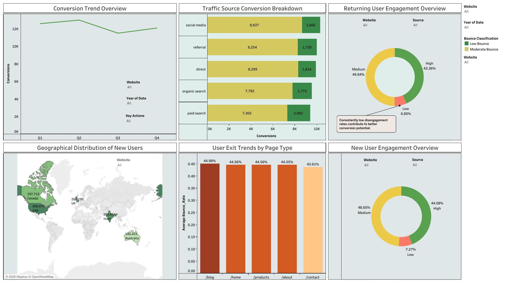

# Website Traffic Dashboard Analysis — Tableau

A personal Tableau project built around a real-world e-commerce scenario, analyzing website traffic performance across conversion trends, traffic source effectiveness, user engagement, bounce behavior, and geographic distribution of new users.

---

## 🔗 Live Dashboard

> **[View Interactive Dashboard on Tableau Public](https://public.tableau.com/views/WebsiteTrafficAnalysis_17714085242800/WebsiteTrafficAnalysis?:language=en-US&:sid=&:redirect=auth&:display_count=n&:origin=viz_share_link)**

---

## 📌 Project Overview

This is a personal portfolio project where I took on the scenario of a data analyst supporting a fast-growing e-commerce client in understanding their website performance. The goal is to support data-driven decision-making by visualizing key web metrics — including traffic source performance, user engagement levels, conversion cycles, and bounce patterns — in a single, interactive interface.

The dashboard is designed for four primary user groups: **Digital Marketing Managers**, **Content Strategists**, **SEO Analysts**, and **Business Stakeholders**, each of whom can interact with filters to extract insights relevant to their role.

---

## 📊 Dataset

**Source:** [Kaggle — Amazon Web Traffic Dataset](https://www.kaggle.com/datasets/bharathkumarbu/amazon-webtraffic-datasets)

The dataset covers Amazon website traffic (Amazon Prime, AWS, AWS Support) and includes the following attributes:

| Attribute | Description |
|---|---|
| Country | User origin |
| Timestamp / Date / Time / Day | Temporal information |
| Device Category | Desktop, Mobile, Tablet |
| Key Actions | Purchase, Sign Up, Subscribe, Download, Contact Form |
| Page Path | /home, /contact, /products, /about, /blog |
| Source | Organic, Paid, Referral, Social Media, Direct |
| Avg. Session Duration | Session length in seconds |
| Bounce Rate | Percentage of single-page sessions |
| Conversions | Total conversion count |
| New & Returning Users | User type counts |
| Page Views | Total page views |
| Avg. Time on Homepage | Time on page in minutes |
| Website | Amazon domain type |

---

## ⚙️ Data Preparation

- Verified and corrected data types for all key attributes
- Removed null and missing values for clean analysis
- **Reformatted Bounce Rate** from whole numbers (e.g., 35) to decimal format (e.g., 0.35) using a calculated field to ensure accurate aggregations
- Created the following **calculated fields**:

  - `Bounce Classification` — Categorizes pages as High Bounce (>70%), Moderate Bounce, or Low Bounce (<30%) using an IF/ELSEIF expression
  - `Engagement Level` — Classifies sessions as High, Medium, or Low based on bounce rate, session duration, and unique page views using a multi-condition IF expression
  - `Bounce_Rate` — Normalized bounce rate field (`[Bounce Rate] / 100`) for visualization accuracy

---

## 📈 Dashboard Components

### 1. Conversion Trend Overview — Line Chart
Tracks overall conversion performance from 2019 to 2023 by quarter. A recurring pattern is evident: conversions peak in Q2, dip in Q3, and recover in Q4, indicating clear seasonal cycles. Filters for Year, Website, and Key Actions allow drill-down analysis.

### 2. Traffic Source Conversion Breakdown — Stacked Bar Chart
Compares conversion volumes across all five traffic sources (Social Media, Referral, Direct, Organic Search, Paid Search), segmented by Bounce Classification. Social media leads in total conversions, while paid search shows the highest moderate-bounce proportion.

### 3. Bounce Rate by Page Type — Bar Chart
Displays average bounce rate across all five page types. All pages sit near 44%, with the blog page showing the highest rate. Useful for identifying underperforming content that requires optimization.

### 4. New User Engagement Overview — Donut Chart
Breaks down new user sessions into High (44%), Medium (49%), and Low (7%) engagement levels. The low disengagement rate indicates the site content and UX are broadly effective for first-time visitors.

### 5. Returning User Engagement Overview — Donut Chart
Mirrors the new user chart for returning visitors, with an annotation highlighting that consistently low disengagement rates contribute to better conversion potential.

### 6. Geographic Distribution of New Users — Map Chart
Visualizes new user counts by country, filterable by website platform. Supports region-specific marketing and budget decisions by identifying high-growth markets.

---

## 📷 Dashboard Preview

> **Overall Dashboard View**

---

## 🧠 Key Insights

- Conversion rates follow a **predictable seasonal cycle** — peaking in Q2 each year (2020, 2021, 2022), providing a clear window for campaign timing
- **Social media drives the highest conversion volume** across all traffic sources, making it the strongest channel for marketing investment
- All page types show a **~44% average bounce rate**, with blog pages performing worst — indicating a content relevance gap requiring attention
- **Disengagement is below 10%** for both new and returning users, reflecting strong overall UX and content quality
- **Paid search has the highest moderate-bounce proportion**, suggesting ad targeting or landing page alignment could be improved

---

## 🛠 Tools & Features Used

| Category | Details |
|---|---|
| Platform | Tableau Public |
| Chart Types | Line, Stacked Bar, Donut, Geographic Map |
| Advanced Features | Calculated Fields, Fixed LOD Expressions, Context Filters |
| Interactivity | Dynamic Filters, Tooltips, Annotations |
| Data Story | 3-point Tableau Story with narrative captions |

---

## 🎓 Learning Outcomes

- Designing multi-audience dashboards with role-based interactivity
- Writing advanced calculated fields including Fixed LOD expressions in Tableau
- Applying data storytelling principles to translate metrics into executive-level narratives
- Cleaning and preprocessing data within a BI tool environment
- Building geographic visualizations and integrating contextual filters for targeted analysis

---

